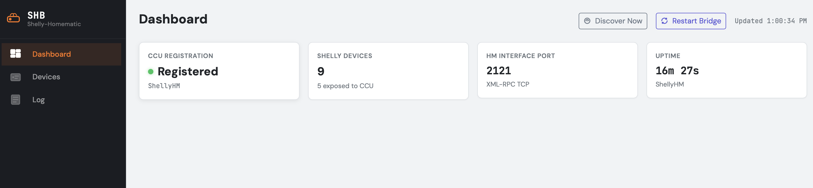
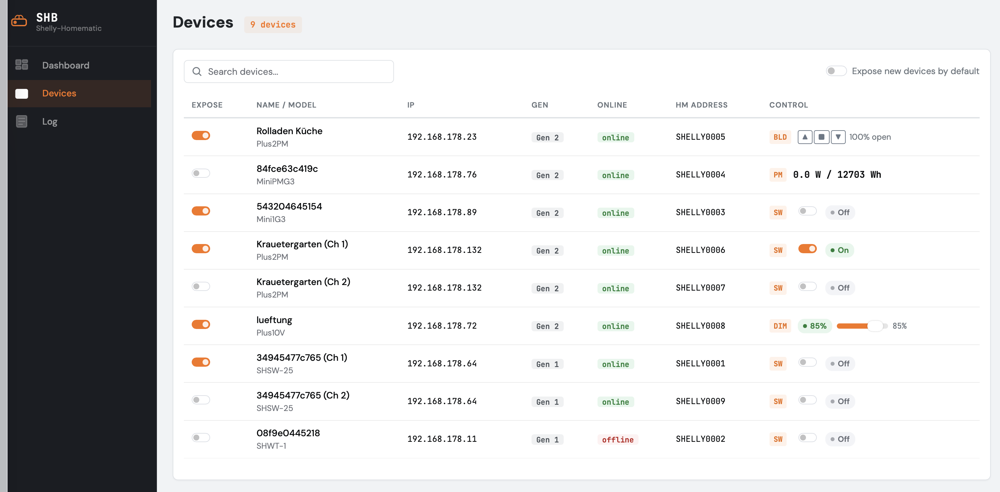

# Shelly-Homematic Bridge

Expose **Shelly** smart-home devices to a **Homematic CCU3 / RaspberryMatic** as native Homematic devices.

Shellys discovered on your network appear on the CCU like regular BidCos radio devices — with native icons, controls, service messages and full support for CCU programs, rooms and the inbox (Posteingang) workflow. No CUxD, no MQTT broker, no cloud.

It is the mirror image of the sister project [matter-homematic](https://github.com/nilsmotsch/matter-homematic) (Homematic → Matter). Here the data flows the other way: the Shelly is the source of truth, and the bridge presents an XML-RPC interface that the CCU connects to like any other (BidCos, HmIP). The two work together: Shellys bridged into the CCU by this project can be re-exported to Apple Home / Google Home via matter-homematic.

> **Status: beta (0.9.x).** The bridge runs stably against a real CCU3, but only part of the device matrix has been verified on real hardware so far — see [Supported devices](#supported-devices) for what has actually been tested. Expect rough edges; issue reports with logs are very welcome.





## Features

- **Native CCU integration** — devices are registered through the CCU's own interface mechanism (`InterfacesList.xml` ipc entry) and impersonate well-known BidCos device types, so the WebUI renders its standard switch/blind/dimmer controls, power meter readings and service messages.
- **Auto-discovery** — Gen2/Gen3 Shellys via mDNS, Gen1 via mDNS/HTTP probing, battery-powered Gen1 sensors via CoIoT multicast. Manual IPs can be configured too.
- **Live state, both directions** — Shelly state changes are pushed to the CCU as events (WebSocket for Gen2/Gen3, polling for Gen1); CCU `setValue` calls (UI, programs) are translated to Shelly RPC commands.
- **Web UI** (default port 8081) — discovery status, per-channel exposure toggles, direct device control, live log.
- **Opt-in exposure** — nothing is announced to the CCU until you enable it (per channel, or flip the default).
- **Digest/basic auth** support for password-protected Shellys.
- **CCU addon packaging** — installable as a regular CCU addon via the WebUI (bundled Node.js runtime, survives reboots and firmware updates).

## Supported devices

Each Shelly channel becomes its own Homematic device. The bridge infers channel types from live device state, so most models work without explicit support:

| Shelly function | Appears on the CCU as | Examples |
|---|---|---|
| Relay / switch | `HM-LC-Sw1-Pl` | Shelly 1, Mini 1 Gen3, Plus 1 |
| Relay with power meter | `HM-ES-PMSw1-Pl` (switch + meter channel) | Plug S, Plus 1PM, Plus 2PM, Shelly 2.5 |
| Roller / cover | `HM-LC-Bl1-FM` | Plus 2PM / 2.5 in cover mode |
| Dimmer / light | `HM-LC-Dim1T-Pl` | Dimmer 2, Plus 0-10V Dimmer |
| Standalone power meter | `HM-ES-TX-WM` | Mini PM Gen3, EM |
| Temperature/humidity sensor | `HM-WDS10-TH-O` | H&T |
| Door/window contact | `HM-Sec-SC-2` | Door/Window 2 |
| Motion sensor | `HM-Sec-MDIR` | Motion 2 |
| Flood sensor | `HM-Sec-WDS` | Flood |

Multi-channel devices (Plus 2PM, Shelly 2.5, …) produce one Homematic device per channel. Gen1, Gen2 and Gen3 devices are supported.

### Test status (beta)

Verified on real hardware against a CCU3:

| Device | Status | Notes |
|---|---|---|
| Shelly Plus 2PM (switch mode) | ✅ Tested | Switching from CCU & Matter, live state updates, power/voltage/current/energy readings |
| Shelly Mini 1 Gen3 | ✅ Tested | Switching, live state updates |
| Shelly Mini PM Gen3 | ✅ Tested | Standalone power meter readings in the CCU |
| Shelly Plus 2PM (cover mode) | ✅ Tested | Up/stop/down and positioning from the CCU, native blind UI, position feedback |
| Shelly Plus 0-10V Dimmer | ✅ Tested | Level control from the CCU, native dimmer UI, live state updates |
| Shelly 2.5 (SHSW-25, Gen1) | ✅ Tested | Switching via the Gen1 HTTP path, both channels, power readings |
| Shelly Flood (SHWT-1, Gen1) | ❌ Untested | Battery/CoIoT device — discovery works, but no wake-up cycle observed yet |
| H&T, Door/Window, Motion | ❓ No hardware | Implemented from state inference, untested — feedback welcome |

The CCU integration itself (teach-in, native controls, device naming, service messages, re-registration across CCU and addon restarts) is tested on CCU3 firmware with ReGaHss. RaspberryMatic should behave identically but hasn't been explicitly verified.

## Installation (CCU addon)

1. Download `shelly-homematic-<version>.tar.gz` from the releases page (or build it yourself with `npm run build:addon`).
2. On the CCU WebUI: **Einstellungen → Systemsteuerung → Zusatzsoftware**, choose the tarball and install. The CCU reboots.
3. The installer registers the `ShellyHM` interface with the CCU and starts the bridge. Open the bridge Web UI at `http://<ccu>:8081`, expose the Shellys you want, and confirm the new devices in the CCU's **Posteingang**.

The addon bundles its own Node.js runtime (armv7/armv6) — nothing else needs to be installed on the CCU. Configuration and device mappings live in `/usr/local/etc/config/addons/shelly-homematic/` and survive addon updates.

### Uninstall / start over

Uninstalling the addon removes its learned devices from the CCU (they would otherwise linger as undeletable orphans) but deliberately **preserves** its stored data (the device address mapping and exposure config). A reinstall therefore re-announces the same devices under their old `SHELLYnnnn` addresses — confirm them in the Posteingang and you're back. To wipe the stored data too — before removing the addon for good, or to start from scratch — use the **Factory Reset** button in the Web UI dashboard first (deletes the address mapping, configuration and CCU callback registrations; a CCU restart is required afterwards).

### Password-protected Shellys

Credentials are never stored in config files. Put them in `/usr/local/etc/config/addons/shelly-homematic/shelly.env`:

```
SHELLY_USER=admin
SHELLY_PASSWORD=secret
```

and restart the addon (`/usr/local/etc/config/rc.d/shelly-homematic restart`).

## Standalone usage (without the addon)

Runs anywhere Node 18+ runs, as long as the machine can reach the Shellys and the CCU can reach the bridge:

```bash
git clone https://github.com/nilsmotsch/shelly-homematic.git
cd shelly-homematic
npm install
cp config.example.json config.json   # adjust ports/discovery as needed
npm run build && npm start
```

You then need to register the interface with your CCU manually: add an `<ipc>` entry to `/usr/local/etc/config/InterfacesList` on the CCU pointing at `xmlrpc://<bridge-host>:2121` with name `ShellyHM`, and restart ReGaHss. (The addon does this for you — standalone is mainly useful for development.)

## Configuration

`config.json` is shallow-merged over built-in defaults, so a minimal file is fine. The full set of options:

```jsonc
{
  "shelly": {
    "discovery": { "mdns": true, "rescanInterval": 300 },
    "manualDevices": ["192.168.1.50"],   // IPs that mDNS doesn't find
    "pollInterval": 5000                  // Gen1 status poll interval (ms)
  },
  "hm": {
    "interfaceName": "ShellyHM",
    "port": 2121,                         // XML-RPC port the CCU connects to
    "bindHost": "0.0.0.0",
    "regaUrl": "http://127.0.0.1:8181/tclrega.exe"  // used to name devices in the CCU
  },
  "devices": {
    "defaultExposed": false,              // opt-in per channel by default
    "exposed": { "aabbccddeeff:0": true } // managed via the Web UI
  },
  "web": { "enabled": true, "port": 8081 },
  "logging": { "level": "info" }
}
```

Devices exposed to the CCU keep their Shelly names: the bridge names the CCU devices automatically (and never overwrites names you change in the CCU afterwards).

## How it works

```
Shelly (mDNS/WebSocket/HTTP/CoIoT)
        │ state events                 ▲ commands
        ▼                              │
  ShellyConnector ──► ShellyBridge ──► Gen1/Gen2 clients
                          │
                          ▼
              HmVirtualInterface (XML-RPC, port 2121)
                          │ event / newDevices        ▲ setValue / getParamset
                          ▼                           │
                    CCU (ReGaHss, HMServer, …)
```

The CCU treats the bridge as one of its device interfaces: on startup it calls `init()` with a callback URL, pulls device descriptions (`listDevices`, `getParamsetDescription`, …), and from then on receives live `event` callbacks. Considerable care went into compatibility with the CCU's strict XML-RPC parser (explicit `Content-Length`, no self-closing tags, explicit `<double>` for float values, correct paramset `FLAGS`/`CONTROL` attributes) — see `CLAUDE.md` for the full list of hard-won constraints.

Thanks to [thkl/Homematic-Virtual-Interface](https://github.com/thkl/Homematic-Virtual-Interface), whose working implementation served as the reference for much of the CCU interface behavior, and to the CUxD project for proving the device-impersonation approach.

## Development

```bash
npm run dev        # run from source (ts-node, reads ./config.json)
npm test           # Jest test suite
npm run lint       # eslint
npm run build:addon  # build the CCU addon tarball (dist-addon/)
```

`scripts/deploy.sh` provides a fast inner loop against a real CCU (pushes the bundle over SSH and restarts the addon); it reads `CCU_HOST`/`CCU_SSH_USER`/`CCU_SSH_PASSWORD` from a gitignored `.env.local`.

## License

[MIT](LICENSE)
